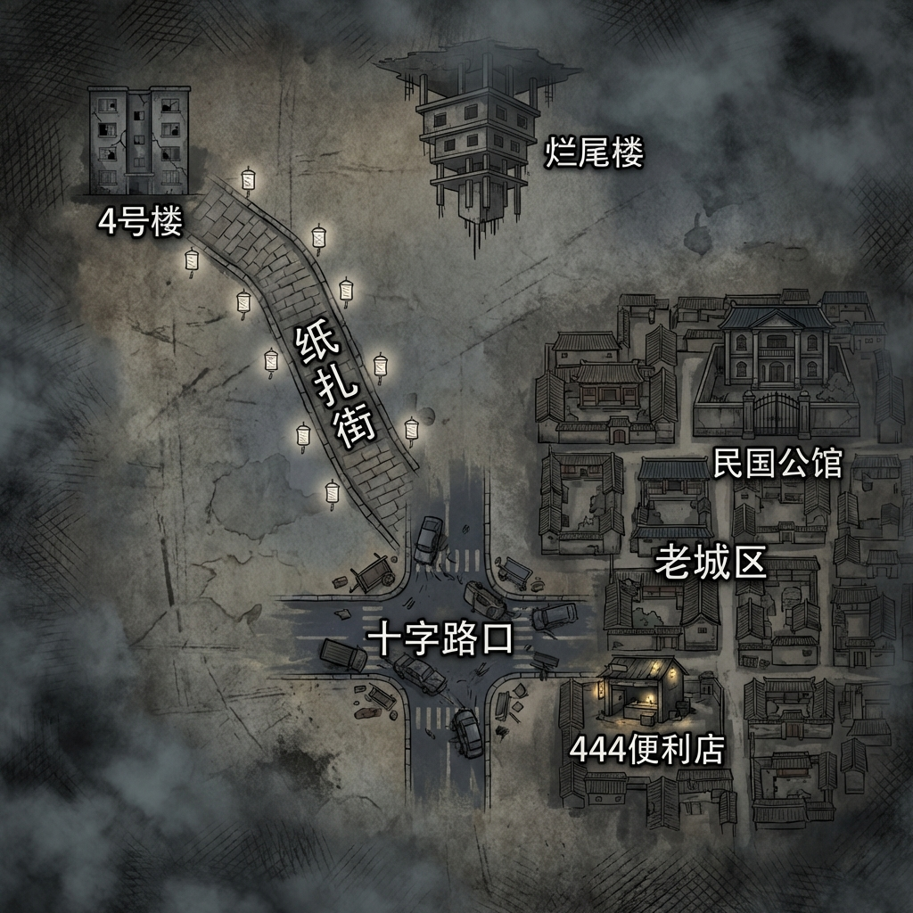

# 第一卷：京都冥界地图（Level 1-2 区域）

# 京都冥界全域战略图（二维俯瞰版）

## **0. 核心地理逻辑：历史的伤疤**
设定集明确“冥界是现实的倒影”。但在高灵知区域（如京都），冥界往往呈现出**“历史重叠态”**。
*   **现实：** 现代化的国家博物馆宿舍区。
*   **冥界：** 宿舍楼（4号楼）孤零零地耸立，但周围的现代化设施消失，取而代之的是这片土地上曾经存在过的、阴气最重的形态——**民国时期的丧葬老街（纸扎街）**。

此逻辑完美解释了为什么走出楼道就是青石板路：陈序是从“现代的孤岛”走进了“历史的海洋”。

冥界是历史的残响，现实是历史的结果。

---

## **2. 区域详情与现实对照**

| 区域名称 | 冥界形态 | 现实对照 (京都西郊) | “倒影”逻辑解释 |
| :--- | :--- | :--- | :--- |
| **4号楼 404室** | **孤岛**。保持着现代装修，但在逐渐腐烂。 | **国博职工宿舍** | 这里是陈序的“锚点”，也是他唯一能感到“秩序”的安全屋。 |
| **纸扎一条街** | **阴市**。满街白灯笼，青石铺路，纸人乱跑。 | **京西老街遗址** | 现实中这里已经被改造为商业街，但在百年前，这里确实是专做死人生意的“丧葬一条街”。冥界复刻了它记忆最深刻的样子。 |
| **民国公馆（入口）** | **空间传送点**。外表是京都老宅，进去后是**金陵颐和路公馆区**。 | **京都老城区某古建** | 冥界的空间不是连续的。因为“民国”最浓郁的气在金陵，所以冥界的京都公馆只是一个“超链接”入口。 |

---

## **3. 对章节规划的审查反馈**

根据这份地图逻辑，审查 `design/章节细纲_13-45.md`：

1.  **空间衔接（Ch 13）：** 
    *   **判定：合理。**
    *   **理由：** 章节中描写“一步跨出，水泥地变青石板”，这正是**现实覆盖层（宿舍）**与**历史基岩层（纸扎街）**的交界线。这种“穿越感”反而增强了冥界的诡异空间感。

2.  **锚点逻辑（Ch 29）：**
    *   **判定：非常精彩。**
    *   **理由：** 既然冥界显化的是“百年前的纸扎街”，那么BOSS的锚点自然应该对应“百年前的凶器（民国剪刀）”。这在逻辑上形成了完美的闭环：**冥界是历史的残响，现实是历史的结果。**

3.  **建议微调：**
    *   在后续章节（如Ch 45走出长街时），可以通过陈知行（民俗专家）的口，点出**“脚下的青石板路其实在现实地下三米处还能挖到”**。这样能瞬间把“恐怖故事”变成“伪科学考古”，极大地增加把诡异上交国家的实感。
